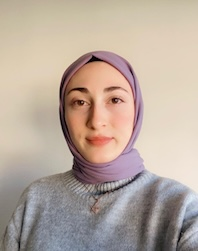

{fig-align="left"}

# Education

-   M.S., Industrial Engineering, Hacettepe University, Turkey, 2026 - ongoing.
-   B.S., Industrial Engineering, Çankaya University, Turkey, 2019 - Jan 2025 

# Work Experience

## Internships

-  ASELSAN, Intern in Production and Project Management Departments, 2023

-  United Parcel Service Inc. (UPS), Intern in Operation Planning Department, 2024

# Projects

-  "Conveyor Flow Balancing and Truck Unloading Scheduling Optimization in Cross-Dock Cargo Operations" (Graduation Project), Oct 2023 – Jul 2024

# Competencies

Minitab, VBA, C#, R, Quarto, Git

# Hobbies

Archery, Volleyball, Cycling, Reading

[⬇ View My CV](assets/cv/Busrah_cv.pdf){.btn .btn-primary target="_blank"}

